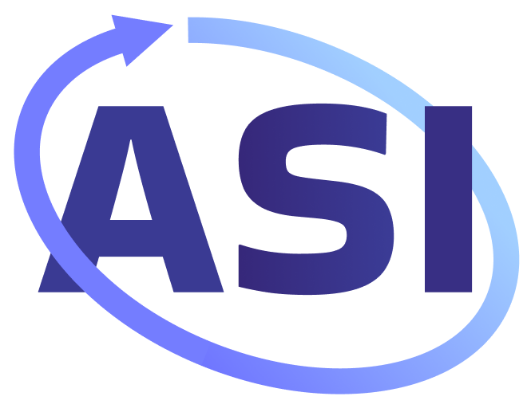
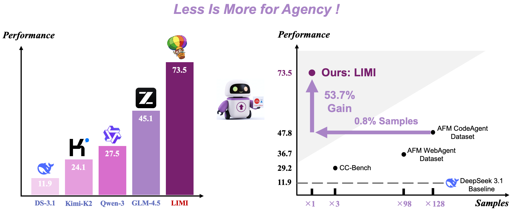
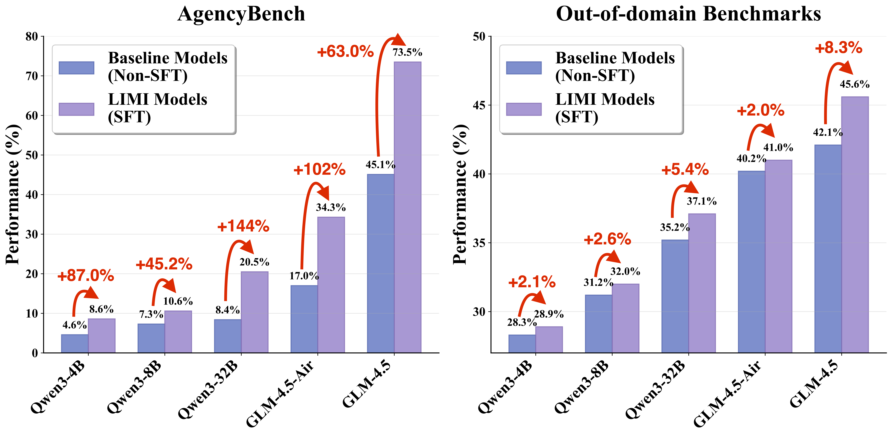

<div align="center">




# LIMI: Less is More for Agency

<p align="center">
   <a href="https://arxiv.org/pdf/2509.17567" target="_blank">Paper</a> &nbsp; | &nbsp;
   <a href="https://huggingface.co/datasets/GAIR/LIMI" target="_blank">Dataset </a> &nbsp; | &nbsp;
   <a href="https://huggingface.co/GAIR/LIMI" target="_blank">Model </a>
</p>


<p align="center">        </p>
</div>

Visit our Hugging Face organization (click links above), search for models and datasets starting with `LIMI`, and you will find all you need! Enjoy!

To learn more about LIMI, feel free to explore our documentation and resources. Our release consists of the following sections:

- **Model Zoo && Quick Start**: Basic usage and demonstrations with Transformers, vLLM, and SGLang for LIMI and LIMI-Air;
- **Training**: Instructions for fine-tuning and post-training with slime framework and distributed training scripts;
- **Evaluation**: Comprehensive evaluation suite with metrics for agentic capabilities assessment;
- **Framework Integration**: Usage of LIMI with frameworks for agentic applications, tool use, and reasoning tasks.

## News

- **2025.10.08**: 📝 Released training scripts for Qwen3 dense models (4B/8B/32B) - check out our [training scripts](https://github.com/GAIR-NLP/LIMI/tree/main/scripts/train) to reproduce the results!
- **2025.10.08**: 📊 Our LIMI dataset significantly enhances dense models on **AgencyBench**: Qwen3-4B (4.6% → 8.6%), Qwen3-8B (7.3% → 10.6%), Qwen3-32B (8.4% → 20.5%).
- **2025.10.08**: 🎯 Strong generalization on **out-of-domain benchmarks** while maintaining performance: Qwen3-4B (28.3% → 28.9%), Qwen3-8B (31.2% → 32.0%), Qwen3-32B (35.2% → 37.1%).
- **2025.09.23**: 🚀 LIMI paper is now available on arXiv! Check out our [paper](https://arxiv.org/pdf/2509.17567) for detailed methodology and experimental results.
- **2025.09.23**: 🤗 Released LIMI models on Hugging Face! Both [LIMI](https://huggingface.co/GAIR/LIMI) (355B) and [LIMI-Air](https://huggingface.co/GAIR/LIMI-Air) (106B) are now available.
- **2025.09.23**: 📊 Released the LIMI training dataset with 78 carefully curated samples on [Hugging Face](https://huggingface.co/datasets/GAIR/LIMI).


## Introduction

LIMI establish the Agency Efficiency Principle: machine autonomy emerges not from data abundance but from strategic curation of high-quality agentic demonstrations. This discovery fundamentally reshapes how we develop autonomous AI systems, suggesting that mastering agency requires understanding its essence, not scaling training data. As industries transition from thinking AI to working AI, LIMI provides a paradigm for sustainable cultivation of truly agentic intelligence.

### Key Highlights

- **A New Data Paradigm**: We challenge the traditional "more is better" data philosophy by achieving superior AI agency with only 78 high-quality samples, proving that data quality far outweighs quantity.

- **Resource Efficiency**: By focusing on core capabilities instead of massive datasets, we significantly reduce the computational resources required for training while effectively boosting the model's performance on complex tasks.

- **Focus on Productive Workers**: Our approach is dedicated to cultivating AI's essential ability to act as a "worker"—to autonomously identify problems, plan, and execute tasks—rather than just "thinking" and "generating."

- **Outperforming Leading Models**: LIMI significantly surpasses multiple large-scale models in AgencyBench, achieving a performance boost of up to 53.7% with only 1/128th of the sample size.

## Performance

### SFT with LIMI Dataset on Dense Models

Our LIMI dataset significantly enhances dense models (Qwen3 series) on both in-domain and out-of-domain benchmarks:

<p align="center">
  
</p>

The figure above demonstrates the effectiveness of our training approach:
- **Left (AgencyBench)**: Substantial improvements on in-domain agentic tasks, with Qwen3-4B (4.6% → 8.6%), Qwen3-8B (7.3% → 10.6%), and Qwen3-32B (8.4% → 20.5%).
- **Right (Out-of-Domain)**: Strong generalization to unseen benchmarks while maintaining performance, with Qwen3-4B (28.3% → 28.9%), Qwen3-8B (31.2% → 32.0%), and Qwen3-32B (35.2% → 37.1%).

### LIMI Models on AgencyBench

Our LIMI models (based on GLM-4.5) achieve state-of-the-art performance across multiple agentic evaluation tasks:

| Model | FTFC (↑) | RC@3 (↑) | SR@3 (↑) | Avg. |
|-------|----------|----------|----------|-----------------|
| GLM-4.5-Air | 15.0 | 16.1 | 20.0 | 17.0 |
| GLM-4.5 | 37.8 | 50.0 | 47.4 | 45.1 |
|GLM-4.5-Code| 48.0 | 48.0|47.5| 47.8|
| **LIMI-Air** | **35.4** | **34.3** | **33.1** | **34.3** |
| **LIMI** | **71.7** | **74.2** | **74.6** | **73.5** |


For detailed benchmark results, experimental setup, and comprehensive comparisons, please refer to our [paper](https://arxiv.org/pdf/2509.17567).

## Model Zoo

Our LIMI models are available on Hugging Face 🤗:

| Model | Backbone | Size | Link |
|-------|----------|------|------|
| **LIMI** | [GLM-4.5](https://huggingface.co/zai-org/GLM-4.5) | 355B | [🤗](https://huggingface.co/GAIR/LIMI) |
| **LIMI-Air** | [GLM-4.5-Air](https://huggingface.co/zai-org/GLM-4.5-Air) | 106B | [🤗](https://huggingface.co/GAIR/LIMI-Air) |


## Datasets

We release our datasets through Hugging Face 🤗:

| Dataset | Description | Link |
|---------|-------------|------|
| **LIMI** | Updated training set for the paper (78 samples) | [🤗](https://huggingface.co/datasets/GAIR/limi) |

## Quick Start

Our models are fine-tuned on [GLM-4.5](https://huggingface.co/zai-org/GLM-4.5) and are compatible with most mainstream frameworks like [HF Transformers](https://github.com/huggingface/transformers), [SGLang](https://github.com/sgl-project/sglang), [Megatron](https://github.com/NVIDIA/Megatron-LM), [slime](https://github.com/THUDM/slime) and etc.

### Using the Latest Model (LIMI)

<details>
<summary>Start with HF Transformers</summary>

```bash
# Install required packages
pip install transformers
```

```python
from transformers import AutoModelForCausalLM, AutoTokenizer
import torch

# Initialize model and tokenizer
model = AutoModelForCausalLM.from_pretrained(
    "GAIR/LIMI",
    torch_dtype="auto",
    trust_remote_code=True,
    device_map="auto"
)
tokenizer = AutoTokenizer.from_pretrained("GAIR/LIMI", trust_remote_code=True)

# Prepare input messages (We use the following template and system prompt during training and inference)
messages = [
    {"role": "system", "content": "You are a helpful assistant tasked with discovering mathematical function structures for scientific systems."},
    {"role": "user", "content": "Modify the \texttt{equation.py} function, considering the physical meaning and relationships of the inputs."}
]

# Format input using chat template
text = tokenizer.apply_chat_template(
    messages,
    tokenize=False,
    add_generation_prompt=True
)

# Tokenize input
inputs = tokenizer(text, return_tensors="pt").to(model.device)

# Generate response
outputs = model.generate(
    **inputs,
    max_new_tokens=128000,
    temperature=0.6,
    top_p=0.95,
    do_sample=True
)

# Decode and print response
response = tokenizer.decode(outputs[0][inputs['input_ids'].shape[1]:], skip_special_tokens=True)
print(response)
```

</details>

<details>
<summary>Start with VLLM</summary>

```bash
# Install required packages
pip install vllm
```


```python
from vllm import LLM, SamplingParams
from transformers import AutoTokenizer

# Initialize the model
llm = LLM(
    model="GAIR/LIMI",
    tensor_parallel_size=4,  # adjust based on available GPUs
    trust_remote_code=True,
    swap_space=60,
    gpu_memory_utilization=0.96,
)

# Prepare input messages (We use the following template and system prompt during training and inference)
messages = [
    {"role": "system", "content": "You are a helpful assistant tasked with discovering mathematical function structures for scientific systems."},
    {"role": "user", "content": "Modify the \texttt{equation.py} function, considering the physical meaning and relationships of the inputs."}
]

# Setup tokenizer
tokenizer = AutoTokenizer.from_pretrained("GAIR/LIMI", trust_remote_code=True)
text = tokenizer.apply_chat_template(
    messages,
    tokenize=False,
    add_generation_prompt=True
)

# Configure generation parameters
sampling_params = SamplingParams(
    temperature=0.6,
    max_tokens=128000,
    top_p=0.95,
)

# Generate response
output = llm.generate(text, sampling_params)
print(output[0].outputs[0].text)
```

</details>


## Training

We utilize [slime](https://github.com/THUDM/slime) framework for training, which provides a convenient and efficient training pipeline.

1. **Environment Setup**
   - Set up slime following their official [documentation](https://github.com/THUDM/slime).
   - Ensure all dependencies are properly installed and configured.

2. **Data Preparation**
   - Obtain the LIMI dataset from [🤗 Hugging Face](https://huggingface.co/datasets/GAIR/LIMI).

3. **Configuration**
   - Use our provided [training script](https://github.com/GAIR-NLP/LIMI/blob/main/scripts/train).
   - The script file contains all necessary hyperparameters and training settings.


## Evaluation

To support the rigorous assessment of agentic capabilities outlined in this work, we release a comprehensive evaluation suite. This framework is designed to benchmark agency for Large Language Models (LLMs) on the held-out evaluation subset $D_{\text{eval}}$.

The evaluation module implements the three key metrics: First-Turn Functional Completeness (FTFC), Success Rate (SR@R) and Remaining Chances (RC@R), with a computational budget of R = 3 rounds. For detailed benchmark tasks, please refer to [AgencyBench](https://agencybench.opensii.ai).


## License

This project is licensed under the MIT License - see the [LICENSE](LICENSE) file for details.

## Citation

```bibtex
@misc{xiao2025limiagency,
      title={LIMI: Less is More for Agency}, 
      author={Yang Xiao and Mohan Jiang and Jie Sun and Keyu Li and Jifan Lin and Yumin Zhuang and Ji Zeng and Shijie Xia and Qishuo Hua and Xuefeng Li and Xiaojie Cai and Tongyu Wang and Yue Zhang and Liming Liu and Xia Wu and Jinlong Hou and Yuan Cheng and Wenjie Li and Xiang Wang and Dequan Wang and Pengfei Liu},
      year={2025},
      eprint={2509.17567},
      archivePrefix={arXiv},
      primaryClass={cs.AI},
      url={https://arxiv.org/abs/2509.17567}, 
}
```
